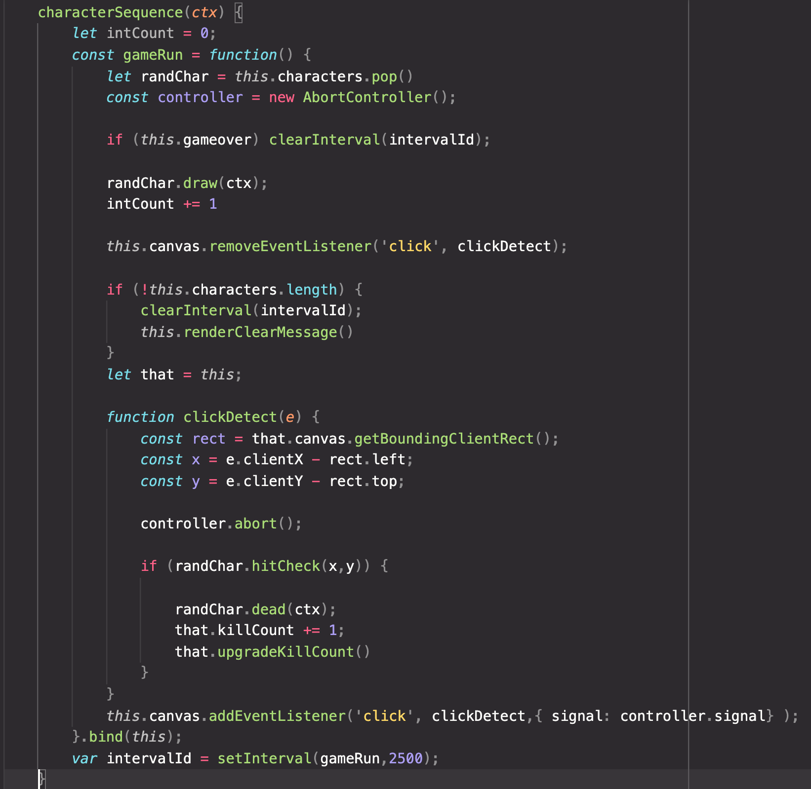

# Alien Invasion

# About:

Alien invasion is a click based shooting game. Aliens and civilians will generate on the screen and the player has to "shoot" the aliens with their mouse before the alien shoots them. The foundation of this game is the utilization of a setInterval calling functions with setTimeouts. In this game, timing was key. This game was inspired by the retro shooting games at Dave & Busters wherein you would shoot at villains on screen with a plastic gun. Good times.

# Core Technology:

* HTML, CSS, Javascript
* Canvas API
* Webpack

# Functionality/MVPs:
* Players will be able to use their mouse to shoot aliens with a blast cannon.
* The cursor will be the aiming mark. Clicking will discharge the blast cannon.
* Random alien generation will also be a core feature.
* Accurate clicks will be detected.

# Game View:

# How the Magic Works/ Game Sequence:

This function is the key to how the game sequence runs. The setInterval calls the gameRun function and runs the sequence until the array of characters are empty or until the game is over.
The characters appear and shoot at the player runs when draw instance method is called on the character instances. Dead characters cannot shoot at you, after they are clicked.