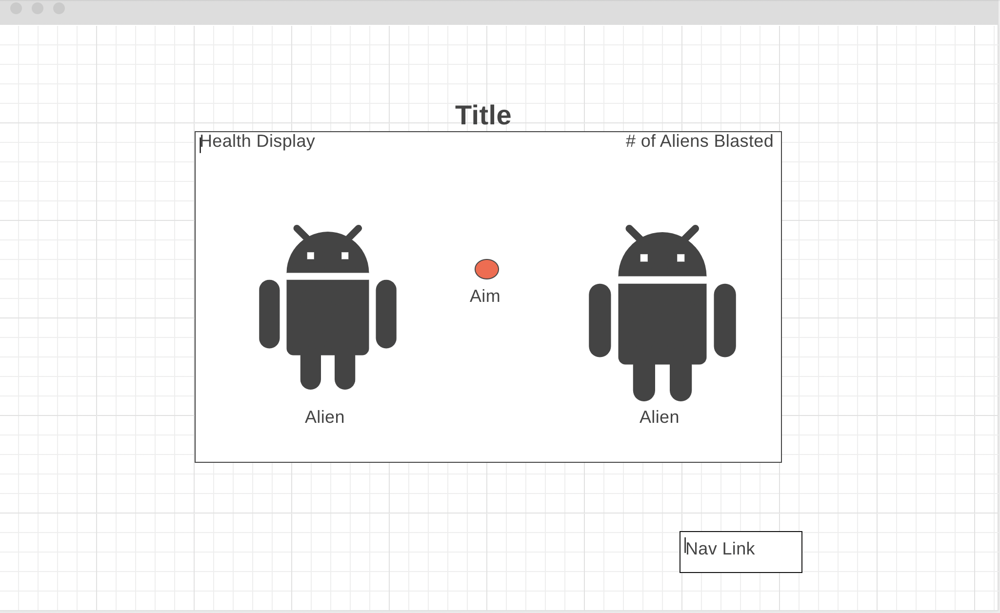

# alienInvasion
# Background:

Alien invasion is a click based shooting game. The city is being overrun by an alien invasion. The player will be ambushed by aliens armed with lasers. Aliens will randomly generate on the screen, after a brief delay, the randomly generated alien will shoot a laser at the player. The player must shoot the alien before being shot by the laser. A single shot will neutralize the alien. The player will lose health each time an alien lands a successful laser shot. 

Random bystanders will also be generated on the screen. If the player shoots a bystander, they will automatically lose the game. The player will also lose if they run out of health. After a successful level completion, the next level will proceed and more aliens will generate. The time between generation and laser shot will also decrease. Therefore, the next level will be harder.

# Functionality & MVPs:

In Alien Invasion, there are several core features in game play. 
* Players will be able to use their mouse to shoot aliens with a blast cannon. 
* The cursor will be the aiming mark. Clicking will discharge the blast cannon. 
* Random alien generation will also be a core feature. 
* Animation will also be featured.

# Wire Frame:

# Technology

* HTML, CSS, Javascript
* Canvas API
* Webpack

# Implementation Timeline:

* Friday & Weekend: Create proper files, canvas, and work random generation logic.
* Monday: Add more levels.
* Tuesday: Make it pretty, animations.
* Wednesday: Add sound effects, play, and debug.
* Thursday Morning: Presentation prep.
